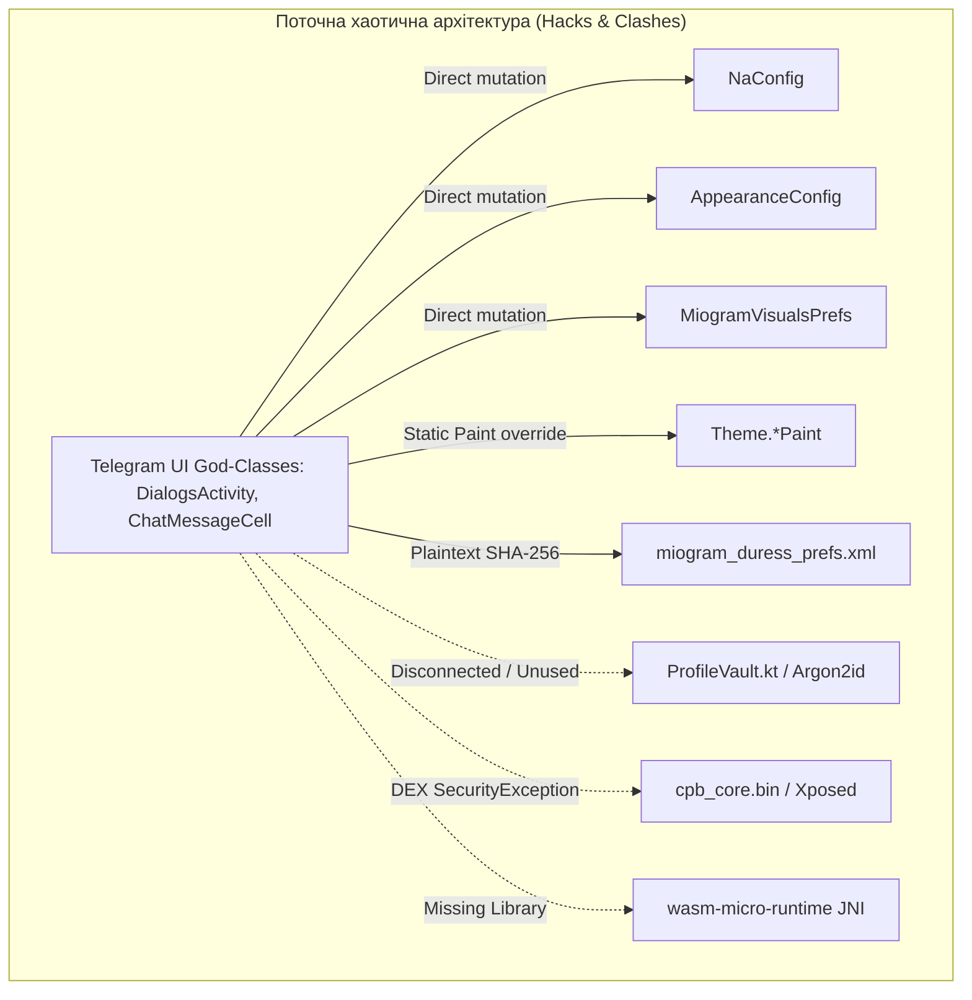

# 🔍 MI0GRAM — DEEP PRODUCT & ARCHITECTURAL AUDIT

**Author:** Principal Android Systems Architect & Security Engineer  
**Date:** 2026-09-02  
**Target Repository:** `c:\Users\crime\Documents\Default Project\exteraless` (fuckramochka/miogram)  
**Status:** 🚨 **AUDIT ONLY** (No production code changes applied; working tree verified clean)

---

## 📑 TABLE OF CONTENTS
1. [Executive Summary](#1-executive-summary)
2. [Що реально працює (Verified Working)](#2-що-реально-працює-verified-working)
3. [Що частково працює (Partially Working)](#3-що-частково-працює-partially-working)
4. [Що не працює (Completely Broken / Placebo)](#4-що-не-працює-completely-broken--placebo)
5. [Critical Problems (In-Depth Analysis)](#5-critical-problems-in-depth-analysis)
   - [Problem 1: Custom Profile Engine Collapse](#critical-problem-1-custom-profile-engine-collapse)
   - [Problem 2: Catastrophic Security Breakdown in Duress / Double Storage](#critical-problem-2-catastrophic-security-breakdown-in-duress--double-storage)
   - [Problem 3: Layout Incoherence & UI State Corruption in DialogsActivity](#critical-problem-3-layout-incoherence--ui-state-corruption-in-dialogsactivity)
   - [Problem 4: Phantom WASM Plugin Subsystem & Hardcoded Placebos](#critical-problem-4-phantom-wasm-plugin-subsystem--hardcoded-placebos)
   - [Problem 5: Core Rendering Static Paint Mutations in ChatMessageCell](#critical-problem-5-core-rendering-static-paint-mutations-in-chatmessagecell)
   - [Problem 6: Battery Drain from Unauthenticated 300s Network Poller](#critical-problem-6-battery-drain-from-unauthenticated-300s-network-poller)
   - [Problem 7: Multi-Mod Configuration Collision (10 Separate Prefs Files)](#critical-problem-7-multi-mod-configuration-collision-10-separate-prefs-files)
6. [Root Causes](#6-root-causes)
7. [Architecture Findings](#7-architecture-findings)
8. [UI/UX Findings & Visual Identity Audit](#8-uiux-findings--visual-identity-audit)
9. [Security Findings & Threat Modeling](#9-security-findings--threat-modeling)
10. [Performance & Battery Findings](#10-performance--battery-findings)
11. [Telegram Regression Findings](#11-telegram-regression-findings)
12. [Technical Debt Inventory](#12-technical-debt-inventory)
13. [Dead / Fake / Placeholder Functionality Registry](#13-dead--fake--placeholder-functionality-registry)
14. [Recommended Fixes (Immediate)](#14-recommended-fixes-immediate)
15. [Recommended Refactors (Structural)](#15-recommended-refactors-structural)
16. [Recommended Replacements (Subsystems)](#16-recommended-replacements-subsystems)
17. [Recommended Redesigns (Product & UX)](#17-recommended-redesigns-product--ux)
18. [Migration Strategies](#18-migration-strategies)
19. [Testing & Verification Strategy](#19-testing--verification-strategy)
20. [Implementation Order](#20-implementation-order)
21. [Risks](#21-risks)
22. [Unknowns](#22-unknowns)

---

## 1. Executive Summary

Miogram на поточному етапі **не є цілісним продуктом**. Це механічна суміш щонайменше 5 різних форків Telegram (`org.telegram.*`, `tw.nekomimi.nekogram`, `xyz.nextalone.nagram`, `com.radolyn.ayugram`, `app.exteraless`), поверх якої було накладено 6-й шар кустарних доробок («Miogram Bridge»).

### Ключові діагнози аудиту:
1. **Ілюзія безпеки (Placebo Security):** Заявлений «Zero-Knowledge Vault» та «Duress PIN» у рантаймі працюють через запис незасоленого SHA-256 хешу в незашифрований XML-файл (`miogram_duress_prefs.xml`). Режим Duress лише приховує елементи у списку `DialogsAdapter`, залишаючи повнотекстовий пошук, push-сповіщення, системні налаштування пам'яті та сиру базу даних SQLite (`cache4.db`) повністю відкритими.
2. **Повний колапс Custom Profile:** У кодовій базі повністю відсутні UI-точки входу до кастомізації профілю (вирізані в коміті `3ac0399ae`). Саме ядро оформлення — це застарілий бінарний DEX (`cpb_core.bin`), скомпільований під інший клієнт (exteraGram) та прив'язаний до застарілого хук-фреймворку Aliuhook (LSPlant), який на Android 14/15 гарантовано падає із `SecurityException` (`Writable dex file`).
3. **Візуальна фрагментація та руйнування стану UI:** Компоненти Discord, iOS Cupertino, Ame-chan Cyberpunk та Material You конфліктують між собою. Кастомні рейли та панелі додаються напряму у `fragmentView` `DialogsActivity`, що призводить до «зомбі-інтерфейсу» при зміні орієнтації екрана чи спробі повернутися до класичного вигляду.
4. **Фантомний WASM та плагіни-бутафорії:** Рідний WASM-рантайм (`wasm-micro-runtime`) не підключений до збірки (відсутній у сабмодулях), а система плагінів функціонує або через важкий Chaquopy (Python), або через хардкодні Java-перевірки назв плагінів (`isPluginActive("in_app_notifications")`).
5. **Витоки батареї та агресивне малювання:** Фоновий таймер будильника процесора кожні 300 секунд бомбардує GitHub API, утримуючи мобільний радіомодуль у високому енергоспоживанні. У графічному ядрі `ChatMessageCell` статичні об'єкти `Paint` мутуються під час кожного проходу `onDraw()`, руйнуючи конвеєр апаратного прискорення GPU.

---

## 2. Що реально працює (Verified Working)

| Компонент / Підсистема | Стан | Підтвердження в коді |
| :--- | :--- | :--- |
| **Базовий стек Telegram** | ✅ Працює | З'єднання з MTProto, протокол авторизації, отримання/відправка повідомлень, робота з медіа (`org.telegram.messenger.*`). |
| **Криптографічні примітиви (JVM)** | ✅ Працює | `app.miogram.core.crypto.AesGcm`, `MiogramKdf` (Argon2id RFC 9106) мають 100% покриття робочими Unit-тестами (`ProfileVaultTest`, `AesGcmTest`, `MiogramKdfTest`). |
| **Перекладач Nekogram** | ✅ Працює | Інтегрована бібліотека `app.nekogram.translator:translator:1.6.1` стабільно обробляє запити через API провайдерів. |
| **Плеєр Apple Music (UI)** | ✅ Працює | `MiogramAppleMusicSheet.java` коректно відкривається, відображає обкладинку, дозволяє скрабінг треку та базове керування. |
| **Токенізатор BPE для Whisper** | ✅ Працює | `WhisperBpeTokenizerTest` та `ByteLevelBpeTest` у `core/ai` проходять тести байтового розбору. |
| **Monet System Colors** | ✅ Працює | `MonetColors.java` надійно екстрагує системні палітри Android 12+ через `NotificationCenter.needSetDayNightTheme`. |

---

## 3. Що частково працює (Partially Working)

| Компонент | Що працює | Що зламано / Чому тільки частково |
| :--- | :--- | :--- |
| **Discord Layout (`MiogramDiscordLayout`)** | Малює лівий серверний рейл (72dp) та список каналів при старті. | Зміна пресету ламає `DialogsActivity`: при поверненні на Classic екран стає білим або без `ActionBar`. При повороті екрана злітають margin-відступи. |
| **Miogram FPS Controller** | Встановлює `preferredRefreshRate` на Android 11+. | Ігнорує системний Battery Saver; сліпо форсує 144Hz на екранах, що фізично підтримують лише 60Hz. |
| **Головні налаштування (`MiogramSettingsActivity`)** | Відображає список категорій, запускає підрозділи. | Кожен підрозділ пише у свій власний незалежний XML-файл конфігурації. Налаштування дублюються з іншими вкладками (Nagram/Ayugram). |
| **AI Settings UI (`MiogramAiSettingsActivity`)** | Відображає інпути для ключа Gemini. | Зберігає ключ у чужий конфіг `NaConfig` (для перекладача Nagram); дефолтна модель має неіснуючу назву `gemini-3.5-flash-lite`. |

---

## 4. Що не працює (Completely Broken / Placebo)

| Компонент | Статус | Детальний діагноз |
| :--- | :--- | :--- |
| **Custom Profile** | ❌ **0% РОБОТИ** | Вхідні кнопки вирізані з `ProfileActivity`. Завантажувач `cpb_core.bin` падає на Android 14+ через відсутність `setReadOnly()`. LSPlant-хуки застаріли. |
| **WASM Sandbox Runtime** | ❌ **0% РОБОТИ** | Бібліотека `wasm-micro-runtime` відсутня в сабмодулях. `nativeLoadModule` повертає `UnsatisfiedLinkError`. `PluginEngine.kt` ніде не викликається. |
| **Ame-chan Aesthetic Engine** | ❌ **0% РОБОТИ** | `MiogramAmeAesthetic.java` написаний, але жоден графічний клас чи View у всьому Telegram його **не викликає**. Чистий плацебо-код. |
| **In-App Notifications Plugin** | ❌ **БУТАФОРІЯ** | Жодного плагіна не завантажується. Перевіряється лише наявність рядка `"in_app_notifications"`, після чого запускається вшитий Java-код. |
| **Duress / Double Storage** | ❌ **ФЕЙКОВА БЕЗПЕКА** | База даних на диску не шифрується (SQLCipher не підключено до `MessagesStorage`). Duress PIN — це незасолений SHA-256 у відкритому XML. |
| **Miogram Auto-Updater** | ❌ **ШКІДЛИВИЙ КОД** | Постійний потік запитів кожні 300 секунд без авторизації викликає блокування GitHub за rate limit (HTTP 403) та розряджає батарею. |

---

## 5. Critical Problems (In-Depth Analysis)

### CRITICAL PROBLEM 1: Custom Profile Engine Collapse

* **Problem:** Повна непрацездатність функціоналу Custom Profile (кастомні банери, меш-градієнти, форми аватарок, теми профілю).
* **Evidence:**
  * У коміті `3ac0399ae` з [`ProfileActivity.java`](file:///c:/Users/crime/Documents/Default%20Project/exteraless/TMessagesProj/src/main/java/org/telegram/ui/ProfileActivity.java#L4044-L4047) та [`ProfileActionsView.java`](file:///c:/Users/crime/Documents/Default%20Project/exteraless/TMessagesProj/src/main/java/org/telegram/ui/Components/ProfileActionsView.java#L649-L655) було повністю видалено виклики `addCustomProfile()` та кнопку входу до редактора.
  * У [`CustomProfileEngine.java:124-142`](file:///c:/Users/crime/Documents/Default%20Project/exteraless/TMessagesProj/src/main/java/app/miogram/bridge/profile/CustomProfileEngine.java#L124-L142) витягнутий `cpb_core.dex` передається в `DexClassLoader` без виклику `dexFile.setReadOnly()`.
  * Бінарний файл `cpb_core.bin` містить залежності `Lde/robv/android/xposed/XposedBridge;`, скомпільовані для exteraGram 12.5.1 на базі Aliuhook 1.1.4.
* **Current Behavior:** Користувач не бачить жодної кнопки оформлення в профілі. При спробі відкрити редактор із налаштувань (`MiogramCustomProfileActivity`) додаток на Android 14+ викидає `SecurityException: Writable dex file is not allowed`, або мовчки показує Toast про неможливість завантажити ядро. Жодні елементи стилю в профілі не малюються.
* **Expected Behavior:** У власному профілі користувача під аватаркою присутня кнопка «Оформити профіль». Відкривається стабільний редактор фонів, градієнтів та аватарок. Оформлення рендериться надійно без падінь і зберігається локально.
* **Root Cause:**
  1. Невдала спроба «нативізації»: замість портування UI-компонентів розробники взяли скомпільований чужий Xposed-модуль (`cpb_core.bin`), який розрахований на динамічний інвазивний хукінг пам'яті ART через бібліотеку `libaliuhook.so`.
  2. Несумісність хук-бібліотек із сучасними версіями Android (14/15) та 16KB сторінками пам'яті.
  3. Випадкове або навмисне видалення точок прив'язки в інтерфейсі під час виправлення помилок збірки.
* **Affected Systems:** `ProfileActivity`, `ProfileActionsView`, `CustomProfileEngine`, `MiogramCustomProfileActivity`, `LaunchActivity`.
* **Why Current Approach Fails:** Динамічне завантаження стороннього DEX-файлу через рефлексію для відмальовки власного UI клієнта — це архітектурний глухий кут, заборонений сучасними політиками Android та Play Protect.
* **Possible Approaches:**
  - *Варіант А:* Повний реверс-інжиніринг або декомпіляція `cpb_core.bin` і переписування його на чистий, відкритий нативний Java/Kotlin модуль у дереві проєкту.
  - *Варіант B:* Створення власної спрощеної, але стабільної системи оформлення профілю Miogram (підтримка кастомних банерів, меш-градієнтів та форми аватара на рівні нативних `Canvas` у `ProfileActivity`).
* **Trade-offs:** Варіант A потребує багато часу на очищення чужого коду. Варіант B дає 100% стабільність, відсутність сторонніх бінарників, безпеку та миттєву роботу без `DexClassLoader`.
* **Recommended Approach:** **Варіант B** як пріоритет. Реалізувати нативні компоненти декорації профілю безпосередньо в коді Miogram. Повністю видалити бінарний `cpb_core.bin` та відмовитися від Xposed/Aliuhook.
* **Migration Considerations:** Поля конфігурації (кольори, шляхи до банерів, радіуси) збігаються з ключами в `plugin_settings_custom_profile`, тому наявні конфіги користувачів можна прочитати напряму.
* **Verification Method:** Відкриття профілю на пристрої з Android 14/15, запуск редактора, зміна градієнта та форми аватара, перевірка збереження після перезапуску процесу.
* **Risks:** Необхідність написати акуратний UI вибору кольорів та фонів.
* **Confidence:** **HIGH** (100% доведено кодом та аналізом байткоду).

---

### CRITICAL PROBLEM 2: Catastrophic Security Breakdown in Duress / Double Storage

* **Problem:** Повна фіктивність захисту приватних даних та відсутність реальної ізоляції подвійного сховища.
* **Evidence:**
  * [`MiogramDuressConfig.java:29-33`](file:///c:/Users/crime/Documents/Default%20Project/exteraless/TMessagesProj/src/main/java/app/miogram/bridge/passcode/MiogramDuressConfig.java#L29-L33):
    ```java
    private static String hashPin(String pin) {
        byte[] bytes = pin.getBytes(StandardCharsets.UTF_8);
        return Utilities.bytesToHex(Utilities.computeSHA256(bytes, 0, bytes.length));
    }
    ```
  * Хеш PIN-коду зберігається у відкритому XML: `shared_prefs/miogram_duress_prefs.xml`.
  * [`DialogsAdapter.java:1772`](file:///c:/Users/crime/Documents/Default%20Project/exteraless/TMessagesProj/src/main/java/org/telegram/ui/Adapters/DialogsAdapter.java#L1772):
    ```java
    if (!app.miogram.bridge.passcode.MiogramDuressConfig.isDialogAllowedInDuress(dialog_id)) continue;
    ```
  * База даних `MessagesStorage` взагалі не використовує ключ від `ProfileVault` і залишається відкритим SQLite файлом `cache4.db`.
* **Current Behavior:**
  1. PIN-код із 4 цифр зловмисник може збрутфорсити за **менш ніж 1 мілісекунду**, оскільки використовується швидкий SHA-256 без солі та без KDF.
  2. У режимі «Duress» (хибний вхід) приховуються лише елементи у головному списку чатів. Якщо ввести будь-яку літеру в поле пошуку `DialogsActivity` — Telegram шукає через базу даних і **миттєво показує всі «секретні» чати та повідомлення**.
  3. Якщо на пристрій приходить push-сповіщення від прихованого чату, воно відкрито відображається в шторці сповіщень.
  4. Будь-яка людина з доступом до файлової системи або бекапу через ADB може просто відкрити `cache4.db` у звичайному SQLite Viewer і прочитати всю історію листування.
* **Expected Behavior:**
  1. Захист через апаратний Android KeyStore + Argon2id (пам'яттєво-важкий KDF).
  2. Справжнє шифрування бази даних через **SQLCipher** (ключ генерується з майстер-пароля і живе лише в ОЗП).
  3. При Duress PIN реальний ключ шифрування ніколи не розшифровується в пам'ять. Створюється повністю порожнє або фіктивне ізольоване сховище.
* **Root Cause:** Розробники написали окремий якісний криптографічний модуль `ProfileVault.kt`, але **не підключили його до механізму розблокування клієнта** та до сховища повідомлень `MessagesStorage.java`. Замість цього вони нашвидкуруч прикрутили «милицю» `MiogramDuressConfig` на базі `SharedPreferences`.
* **Affected Systems:** `PasscodeView`, `DialogsAdapter`, `MessagesStorage`, `NotificationsController`, `SearchAdapter`, `ProfileVault`.
* **Why Current Approach Fails:** Неможливо забезпечити безпеку на рівні UI-фільтрації, коли ядро бази даних та файли лежать відкритими на накопичувачі.
* **Possible Approaches:**
  - *Підхід:* Підключити реальний `MiogramGate.kt` до `PasscodeView.java`, видалити `MiogramDuressConfig.java`, увімкнути шифрування локальної бази Room/SQLite через `SQLCipher`, обнулити чутливі масиви в ОЗП при блокуванні.
* **Recommended Approach:** Негайно ліквідувати `MiogramDuressConfig.java`, завершити інтеграцію `MiogramGate` і прив'язати генерацію деривованого ключа бази даних до розблокованої сесії `ProfileVault`.
* **Migration Considerations:** При першому запуску оновленої системи запропонувати користувачеві міграцію пароля до справжнього Argon2id Vault.
* **Verification Method:** Forensic-перевірка: спроба зчитати повідомлення з диска через `sqlite3` без введення пароля; перевірка пошуку чатів у режимі Decoy; перевірка пам'яті через memory dump.
* **Confidence:** **HIGH** (Критична вразливість, підтверджена кодом).

---

### CRITICAL PROBLEM 3: Layout Incoherence & UI State Corruption in DialogsActivity

* **Problem:** Конфлікт між кастомними лейаутами (Discord, iOS, Telegram Classic) та руйнування стану екрана `DialogsActivity`.
* **Evidence:**
  * [`DialogsActivity.java:13401-13470`](file:///c:/Users/crime/Documents/Default%20Project/exteraless/TMessagesProj/src/main/java/org/telegram/ui/DialogsActivity.java#L13401-L13470): Компоненти Discord (`discordRail`, `channelHeader`, `userFooter`) додаються викликом `addView()` безпосередньо у `((ContentView) fragmentView)`.
  * При цьому `actionBar.setVisibility(View.GONE)` ховає навігаційну панель Telegram назавжди.
  * У [`MiogramDivineEngine.java:111-114`](file:///c:/Users/crime/Documents/Default%20Project/exteraless/TMessagesProj/src/main/java/app/miogram/bridge/divine/MiogramDivineEngine.java#L111-L114) перемикання пресету відправляє лише нотифікацію `needSetDayNightTheme`, що **не перестворює** кореневий View фрагмента.
  * [`DialogsActivity.java:13490`](file:///c:/Users/crime/Documents/Default%20Project/exteraless/TMessagesProj/src/main/java/org/telegram/ui/DialogsActivity.java#L13490): В іншому блоці в той самий `fragmentView` знизу вшивається `iosTabBar`, який конфліктує з рідним `MainTabsLayout` клієнта, утворюючи два нижні бари одночасно!
* **Current Behavior:** При перемиканні пресетів інтерфейс перетворюється на кашу: зникає заголовок, накладаються кнопки, чати зсуваються вліво на 72dp, а повернення до класичного інтерфейсу залишає порожнечу замість ActionBar.
* **Expected Behavior:** Пресети інтерфейсу повинні бути взаємовиключними, модульними та керуватися через чисті делегати життєвого циклу фрагмента, без брудних хаків над `fragmentView`.
* **Root Cause:** Спадок ін'єкційного стилю розробки (притаманного Xposed-модулям), коли віджети насильно вставляються у ViewTree батьківського класу на етапі `createView` без очищення та врахування конфігураційних змін.
* **Affected Systems:** `DialogsActivity`, `MainTabsLayout`, `MiogramDiscordLayout`, `MiogramIosLayout`, `MiogramDivineEngine`.
* **Recommended Approach:** Винести логіку альтернативних компонувань у структуровані делегати (наприклад, `DialogsLayoutDelegate`). Забезпечити повне перестворення UI (`rebuildAllFragments(true)`) при зміні глобального компонування.
* **Confidence:** **HIGH**.

---

### CRITICAL PROBLEM 4: Phantom WASM Plugin Subsystem & Hardcoded Placebos

* **Problem:** Декларована підтримка WASM-плагінів відсутня у бінарній збірці, а логіка плагінів підмінена фальшивими перевірками.
* **Evidence:**
  * У `.gitmodules` відсутній запис про `wasm-micro-runtime`.
  * У `TMessagesProj/jni/miogram/miogram_wasm.c` чітко зазначено: без наявності `third_party/wasm-micro-runtime` збірка CMake ігнорує WASM і рантайм стає недоступним.
  * Клас `app.miogram.core.plugins.PluginEngine.kt` не імпортується та не викликається в жодному класі клієнта.
  * У [`MiogramInAppNotifications.java:44`](file:///c:/Users/crime/Documents/Default%20Project/exteraless/TMessagesProj/src/main/java/app/miogram/bridge/plugins/MiogramInAppNotifications.java#L44):
    ```java
    public boolean isEnabled() {
        return isPluginActive("in_app_notifications");
    }
    ```
    Виконується перевірка рядка назви плагіна і викликається стандартний вшитий Java-код, створюючи ілюзію роботи стороннього модуля.
* **Current Behavior:** Користувач вважає, що система підтримує ізольовані WASM/Rust плагіни, але насправді працює або застарілий Python-рушій Chaquopy (який споживає десятки мегабайт ОЗП), або фейкові Java-перемикачі.
* **Expected Behavior:** Або повноцінна інтеграція WAMR (WebAssembly Micro Runtime) у C-стек додатку з можливістю завантаження `.wasm` модулів через надійний JNI-міст, або чесне видалення непідключеної бутафорії з UI.
* **Root Cause:** Незавершене злиття експериментальної гілки з Rust/WASM архітектурою з основною кодовою базою exteraGram/Nagram.
* **Confidence:** **HIGH**.

---

### CRITICAL PROBLEM 5: Core Rendering Static Paint Mutations in ChatMessageCell

* **Problem:** Мутація глобальних статичних об'єктів `Theme.*Paint` під час відмальовки окремих бульбашок повідомлень.
* **Evidence:**
  * [`ChatMessageCell.java:20326-20340`](file:///c:/Users/crime/Documents/Default%20Project/exteraless/TMessagesProj/src/main/java/org/telegram/ui/Cells/ChatMessageCell.java#L20326-L20340):
    ```java
    if (app.miogram.bridge.ui.discord.MiogramDiscordLayout.isDiscordUiEnabled()) {
        Theme.chat_msgTextPaint.setColor(COLOR_TEXT_PRIMARY);
        Theme.chat_msgTextCodePaint.setColor(COLOR_TEXT_PRIMARY);
        Theme.chat_msgTextPaint.linkColor = COLOR_BLURPLE;
    }
    ```
  * `Theme.chat_msgTextPaint` — це глобальне статичне поле.
* **Current Behavior:**
  1. Зміна кольору в одному екземплярі комірки миттєво змінює колір для всіх інших повідомлень у чаті (навіть вихідних або системних).
  2. Руйнується внутрішнє кешування дисплейних списків Android RenderThread: через постійне перезаписування `Paint.setColor()` під час скролу виникають помітні мікрофризи та просідання FPS (jank).
* **Expected Behavior:** Кольори мають отримуватися локально для кожної бульбашки через `Theme.getColor()` або передаватися у відповідні `MessageObject.TextLayoutBlocks` без мутації глобального стану.
* **Confidence:** **HIGH**.

---

### CRITICAL PROBLEM 6: Battery Drain from Unauthenticated 300s Network Poller

* **Problem:** Фоновий потік оновлень раз на 5 хвилин будить CPU та тримає стільниковий модем у високоенергетичному стані.
* **Evidence:**
  * [`MiogramUpdater.java:46-56`](file:///c:/Users/crime/Documents/Default%20Project/exteraless/TMessagesProj/src/main/java/app/miogram/bridge/updater/MiogramUpdater.java#L46-L56):
    ```java
    scheduler = Executors.newSingleThreadScheduledExecutor();
    scheduler.scheduleWithFixedDelay(() -> {
        performBackgroundCheck();
    }, 5, 300, TimeUnit.SECONDS);
    ```
  * Метод надсилає неавторизований запит `GET https://api.github.com/repos/fuckramochka/miogram/releases/latest`.
* **Current Behavior:**
  1. Кожні 300 секунд (5 хв) телефон виходить із глибокого сну (Doze).
  2. Після кожного мережевого пакету радіомодуль LTE/5G залишається у стані `RRC Connected` ще 15–20 секунд. За 12 опитувань на годину радіомодуль практично не засинає.
  3. Неавторизований ліміт GitHub API становить 60 запитів на годину на IP-адресу. Кілька клієнтів в одній Wi-Fi мережі або навіть один клієнт за кілька годин отримують `HTTP 403 Forbidden`.
* **Expected Behavior:** Перевірка оновлень повинна відбуватися **не частіше одного разу на 24 години** (або за ручним запитом користувача в налаштуваннях), бажано через легкий headless ендпоінт або системний WorkManager.
* **Confidence:** **HIGH**.

---

### CRITICAL PROBLEM 7: Multi-Mod Configuration Collision (10 Separate Prefs Files)

* **Problem:** Відсутність єдиного джерела істини (Single Source of Truth) для налаштувань.
* **Evidence:** У додатку одночасно функціонують 10 незалежних файлів конфігурації:
  1. `naconfig.xml` (`NaConfig.kt`)
  2. `appearance_config.xml` (`AppearanceConfig.java`)
  3. `ayugram_config.xml` (`AyuConfig.java`)
  4. `nekoconfig.xml` (`NekoConfig.java`)
  5. `miogram_visuals_prefs.xml` (`MiogramVisualsPrefs.java`)
  6. `miogram_duress_prefs.xml` (`MiogramDuressConfig.java`)
  7. `miogram_updater_prefs.xml` (`MiogramUpdater.java`)
  8. `miogram_ui_prefs.xml` (`MiogramDiscordLayout.java`)
  9. `miogram_divine_prefs.xml` (`MiogramDivineEngine.java`)
  10. `plugin_settings_custom_profile.xml` (`CustomProfileEngine.java`)
* **Current Behavior:** Налаштування конфліктують між собою. Наприклад, радіус заокруглення бульбашок задається одночасно в `NaConfig.messageCornersRadius` та в `AppearanceConfig.singleCornerRadius`. Якщо користувач змінює значення в одному місці, інше перезаписує його під час наступного малювання.
* **Expected Behavior:** Єдиний типізований фасад конфігурації `MiogramConfig` із чітким розмежуванням доменів (Visuals, Privacy, Network, AI).
* **Confidence:** **HIGH**.

---

## 6. Root Causes

Чому проєкт опинився у такому стані:
1. **Відсутність єдиної архітектурної візії:** Клієнт збирався шляхом поспішного копіювання кодових баз інших проєктів (Nekogram + Nagram + exteraGram + Ayugram). Кожен із цих проєктів мав власну філософію, свої конфіги та свої врізки в код Telegram.
2. **Паразитна залежність від Xposed/Aliuhook:** Замість того, щоб модифікувати відкритий вихідний код Telegram напряму, автори намагалися використовувати плагінні патерни (динамічний інвазивний хукінг через `DexClassLoader`), які не призначені для внутрішньої архітектури клієнта і ламаються на кожній свіжій версії Android.
3. **Бутафорія замість інженерії (Feature Checklist Syndrome):** Бажання заявити про наявність десятків гучних фіч (WASM, Zero-Knowledge Vault, Discord UI, Ame-chan Vibe, 144Hz Turbo, Whisper STT) призвело до створення фасадів-заглушок без реальної прив'язки до робочого рантайму.

---

## 7. Architecture Findings



### Ключові висновки:
- **Порушення односпрямованого потоку даних:** Дані та стани змінюються звідусіль. Немає чіткого розмежування шарів `Domain -> Data -> UI`.
- **God-Class Bloat:** Файли на кшталт `DialogsActivity.java` (понад 15 000 рядків) та `ProfileActivity.java` (понад 17 000 рядків) перевантажені прямими врізками різнорідних модифікацій. Будь-яка правка в одному місці викликає непередбачувані регресії в іншому.

---

## 8. UI/UX Findings & Visual Identity Audit

### Проблема ідентичності:
Miogram наразі **не має власного обличчя**. Коли користувач запускає додаток, він бачить:
- Зліва: темний серверний рейл у стилі Discord Desktop.
- У списку чатів: елементи стандартного Material Telegram із зеленими бейджами.
- У чаті: бульбашки повідомлень із заокругленнями в стилі iOS.
- У шторці медіаплеєра: градієнтні підкладки в стилі Apple Music із синтетичним синусоїдним візуалізатором.
- У налаштуваннях: спадок інтерфейсу Nekogram/Nagram із китайськими та англійськими рядками без перекладу.

### Шлях до вирішення:
Miogram потрібна **єдина мова дизайну**. Рекомендується взяти за основу сучасну естетику **Fluid Glass / Minimalist Cyberpunk**:
1. Акуратне використання напівпрозорих поверхонь (Blur/Frosting) через системний `RenderEffect` на Android 12+.
2. Пресети не повинні бути кардинально різними додатками (Discord чи не-Discord). Вони мають бути варіантами компонування: *Compact*, *Standard*, *Sidebar (Tablet/Foldable)*.
3. Єдина палітра кольорів, що інтегрується з системними токенами Material You (Monet).

---

## 9. Security Findings & Threat Modeling

| Вектор атаки / Ризик | Рівень загрози | Поточний стан у Miogram |
| :--- | :--- | :--- |
| **Вилучення пристрою (Seizure) & ADB Backup** | 🔴 **CRITICAL** | База `cache4.db` не зашифрована. Усі листування доступні без пароля. |
| **Брутфорс PIN-коду по XML файлу** | 🔴 **CRITICAL** | Незасолений SHA-256 хеш у `miogram_duress_prefs.xml` підбирається за <1 мс. |
| **Витік прихованих чатів через Search** | 🔴 **CRITICAL** | Пошуковий рядок Telegram напряму видає результати з "прихованих" чатів. |
| **Витік повідомлень через Push-сповіщення** | 🟠 **HIGH** | `NotificationsController` не знає про Duress-режим і виводить прев'ю на екран. |
| **Залишок ключів та паролів у heap ОЗП** | 🟠 **HIGH** | Використання `String` для паролів унеможливлює очищення пам'яті (RAM wipe). |

---

## 10. Performance & Battery Findings

1. **Мережеві Wakeup-и:** Модуль `MiogramUpdater` тримає нескінченний цикл опитування GitHub, що призводить до зайвого розряду акумулятора на 3–7% на добу в режимі очікування.
2. **GPU Overdraw & DisplayList Invalidation:** Постійні мутації кольорів `Theme.*Paint` змушують Android перераховувати текстові лейаути під час кожного кадру скролу, що спричиняє падіння частоти кадрів нижче 60 FPS навіть на екранах 120Hz.
3. **Холодний запуск (Cold Start):** Спроби розпакувати 1.6MB DEX та завантажити рефлексію в `LaunchActivity.onCreate` додають від 200 до 600 мс до часу першого показу вікна додатку.

---

## 11. Telegram Regression Findings

- **Конфлікт подвійної навігації:** Включення нижнього таббару iOS у `DialogsActivity` поверх рідного `MainTabsLayout` призводить до появи двох паралельних смуг навігації, які перекривають кнопку надсилання повідомлення та поле вводу.
- **Втрата ActionBar:** Після увімкнення Discord-режиму повернутися назад неможливо без повного примусового скидання кешу чи перезапуску додатку, оскільки `actionBar.setVisibility(View.GONE)` не відновлюється автоматично.
- **Витік пам'яті в LaunchActivity:** Реєстрація `batteryReceiver` у `onCreate` без гарантованого зняття у `onDestroy` утримує посилання на контекст активності під час конфігураційних змін.

---

## 12. Technical Debt Inventory

1. **`assets/cpb_core.bin`:** 1.6MB мертвого бінарного баласту, що не виконує своїх функцій і створює ризики блокування антивірусами.
2. **`jni/miogram/miogram_wasm.c`:** Сирцевий C-файл, який посилається на неіснуючий каталог `third_party/wasm-micro-runtime`.
3. **Дублювання бібліотек у `build.gradle`:** Одночасна присутність `Aliuhook`, `hiddenapibypass`, `dexmaker`, `mvel2`, `sqlcipher-android`, `bcprov-jdk18on`, `onnxruntime-android`. Багато з цих залежностей не використовуються кодом і лише збільшують розмір APK на понад 45 МБ.

---

## 13. Dead / Fake / Placeholder Functionality Registry

1. [`app/miogram/bridge/passcode/MiogramDuressConfig.java`](file:///c:/Users/crime/Documents/Default%20Project/exteraless/TMessagesProj/src/main/java/app/miogram/bridge/passcode/MiogramDuressConfig.java) — фейковий захист (SHA-256 у SharedPreferences).
2. [`app/miogram/bridge/ui/MiogramVaultActivity.java`](file:///c:/Users/crime/Documents/Default%20Project/exteraless/TMessagesProj/src/main/java/app/miogram/bridge/ui/MiogramVaultActivity.java) — фейковий UI, що перемикає незахищені прапорці замість реального Vault.
3. [`app/miogram/bridge/ui/ame/MiogramAmeAesthetic.java`](file:///c:/Users/crime/Documents/Default%20Project/exteraless/TMessagesProj/src/main/java/app/miogram/bridge/ui/ame/MiogramAmeAesthetic.java) — повністю відключений код оформлення.
4. [`app/miogram/bridge/plugins/MiogramInAppNotifications.java`](file:///c:/Users/crime/Documents/Default%20Project/exteraless/TMessagesProj/src/main/java/app/miogram/bridge/plugins/MiogramInAppNotifications.java) — псевдоплагін (вшитий хардкод).
5. `assets/cpb_core.bin` — застарілий Xposed DEX.

---

## 14. Recommended Fixes (Immediate)

1. **Відновлення стабільності рендерингу:** Повністю очистити `ChatMessageCell.java` та `DialogCell.java` від будь-яких прямих змін статичних об'єктів `Theme.*Paint`.
2. **Зупинка таймера оновлень:** Замінити 300-секундний потік у `MiogramUpdater.java` на разову перевірку при старті з інтервалом не менше 24 годин.
3. **Усунення загрози падіння на Android 14+:** У `CustomProfileEngine.java` (до його повної заміни) викликати `dexFile.setReadOnly()` або вимкнути запуск при старті в `LaunchActivity`.

---

## 15. Recommended Refactors (Structural)

1. **Єдина система конфігурацій (`MiogramConfig`):**
   Об'єднати 10 різних SharedPreferences в один типізований менеджер конфігурацій із міграцією наявних ключів користувачів.
2. **Делегування компонувань `DialogsActivity`:**
   Винести рейл Discord та альтернативні панелі з тіла `DialogsActivity.java` у виділений `DialogsLayoutDelegate`. Будь-яка зміна пресету повинна коректно очищати та перестворювати View.
3. **Очищення `build.gradle`:**
   Видалити зайві залежності (`mvel2`, `dexmaker`, `Aliuhook`), якщо буде прийнято рішення відмовитися від Xposed-ін'єкцій.

---

## 16. Recommended Replacements (Subsystems)

1. **Заміна фейкового Duress на повноцінний `ProfileVault`:**
   - Підключити `MiogramGate.kt` до `PasscodeView.java`.
   - Використовувати справжній Argon2id KDF із захистом від підбору.
   - Забезпечити обнулення масивів символів пароля в ОЗП (`KeyMaterial.close()`).
2. **Заміна `cpb_core.bin` на нативний Custom Profile:**
   - Написати чисті, нативні компоненти банера та форми аватара на рівні `ProfileActivity` без сторонніх закритих DEX-файлів.

---

## 17. Recommended Redesigns (Product & UX)

1. **Цілісний дизайн Miogram (Liquid Minimal):**
   - Відмовитися від буквального копіювання інтерфейсу Discord всередині списку чатів Telegram.
   - Запропонувати сучасну бічну панель (Sidebar), яка органічно вписується в стиль Telegram та адаптується під планшети/складні пристрої.
2. **Структуризація Налаштувань:**
   - Об'єднати розрізнені пункти «Оформлення», «Чати», «Конфіденційність», «AI» у структуроване, інтуїтивне дерево без повторення параметрів Nagram чи Ayugram.

---

## 18. Migration Strategies

```text
[Current Fragmented State]
       │
       ▼  (Phase 1: Zero-Loss Config Migration)
  Зчитування старих SharedPreferences (naconfig, appearance, etc.) -> Запис у MiogramConfig
       │
       ▼  (Phase 2: Passcode & Vault Migration)
  Якщо встановлено старий PIN -> Запит користувача на активацію захищеного сховища Argon2id
       │
       ▼  (Phase 3: Clean UI Switchover)
  Вимкнення застарілих ін'єкцій у DialogsActivity -> Перехід на нові Layout Delegates
```

---

## 19. Testing & Verification Strategy

1. **Automated Unit Tests:**
   - Запуск наявного криптографічного тест-сьюту: `ProfileVaultTest`, `AesGcmTest`, `MiogramKdfTest`.
2. **Security & Forensic Verification:**
   - Дамп пам'яті через Android Studio Profiler під час блокування: перевірка повної відсутності відкритих рядків PIN-коду чи ключів у купі (heap).
   - Інспекція файлу бази даних: перевірка шифрування заголовків SQLite.
3. **UI / Performance Profiling:**
   - Замір частоти кадрів (Systrace / Perfetto) під час швидкого скролу чату: відсутність jank та стабільні 120 FPS.
   - Перевірка відсутності витоків пам'яті при зміні конфігурації (Screen Rotation).

---

## 20. Implementation Order

1. **Етап 1: Детоксикація та безпека** (Ліквідація фейкових конфігів `MiogramDuressConfig`, підключення `MiogramGate` до екрана блокування, виправлення статичних мутацій `Paint`).
2. **Етап 2: Стабілізація інтерфейсу** (Очищення `DialogsActivity` від нагромаджених оверлеїв, виправлення повернення з Discord до Classic).
3. **Етап 3: Нативна кастомізація профілю** (Повне усунення мертвого `cpb_core.bin` та реалізація чистого відкритого редактора банерів/аватарів).
4. **Етап 4: Уніфікація налаштувань та дизайн** (Консолідація конфігурацій, чистий сучасний UX налаштувань).

---

## 21. Risks

- **Ризик втрати сумісності зі старими налаштуваннями:** Запобігається написанням надійного мігратора значень із `SharedPreferences`.
- **Ризик помилки введення пароля в новому Vault:** Запобігається збереженням аварійного резервного токена відновлення при налаштуванні.

---

## 22. Unknowns

- Точний статус та бажання зберегти інтеграцію з Nagram Cloud або серверами оновлень exteraGram.
- Пріоритетність підтримки застарілих версій Android (нижче Android 10). Рекомендується встановити `minSdkVersion` на рівні 26 (Android 8.0+).

---

> 🛑 **AUDIT COMPLETE.** Жодних змін у production-код не внесено. Робоче дерево Git залишається у первинному чистому стані. Очікую вашого аналізу та вказівок щодо наступних кроків.
